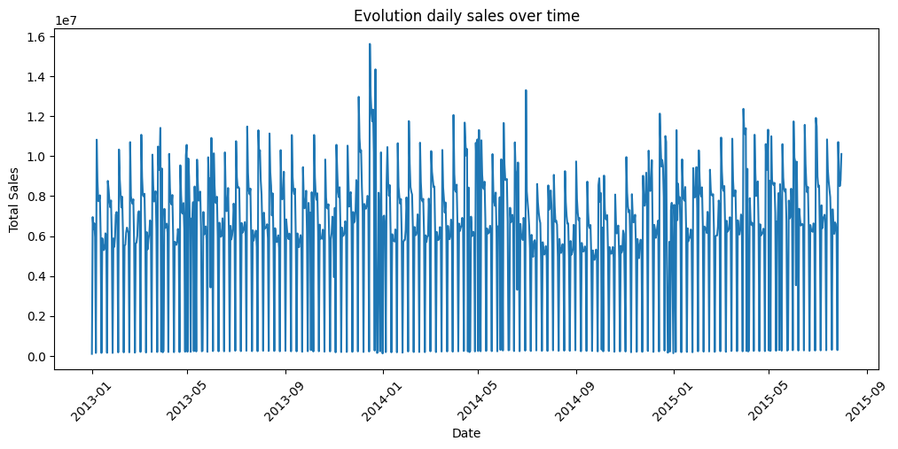
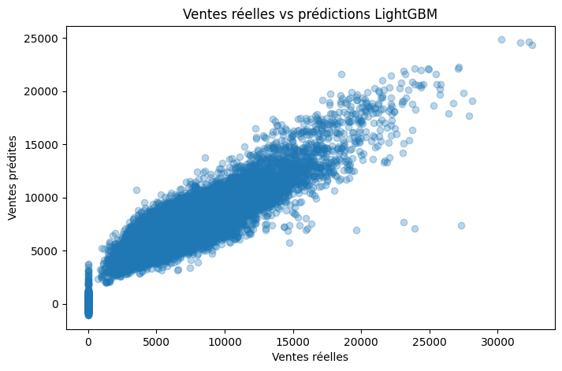
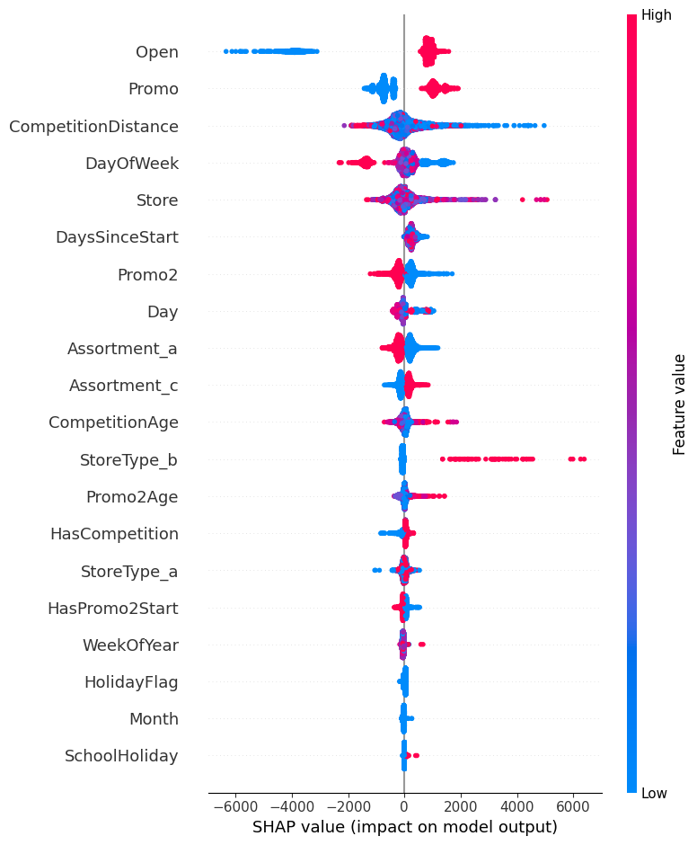

# Modélisation prédictive des ventes retail avec Machine Learning

## Contexte

La prévision des ventes est un enjeu majeur pour les enseignes de distribution. Des estimations fiables permettent d'optimiser les stocks, d'anticiper la demande, de planifier les promotions et d'améliorer la prise de décision.

Ce projet consiste à développer un modèle de Machine Learning capable de prédire les ventes quotidiennes de magasins à partir de données historiques, d'informations sur les promotions, la concurrence et les caractéristiques des magasins.

---

## Objectifs

- Construire un modèle de prédiction des ventes quotidiennes
- Identifier les variables ayant le plus d'impact sur les ventes
- Interpréter les prédictions grâce à l'Explainable AI (SHAP)
- Produire un pipeline complet allant de la préparation des données jusqu'à l'évaluation du modèle

---

## Dataset

Dataset : **Rossmann Store Sales** (Kaggle)

Le jeu de données contient plus de **1 million d'observations** couvrant la période :

- **Janvier 2013 → Juillet 2015**
- plus de **1 100 magasins**
- informations commerciales, promotions, concurrence et calendrier

**Source :**  https://www.kaggle.com/competitions/rossmann-store-sales
---

# Technologies utilisées

- Python
- Pandas
- NumPy
- Matplotlib
- Scikit-Learn
- LightGBM
- SHAP
- Joblib
- Jupyter Notebook

---

# Préparation des données

Les principales étapes de préparation comprennent :

- traitement des valeurs manquantes
- suppression des variables inutiles
- création de variables temporelles
- création de variables métier
- encodage des variables catégorielles
- séparation temporelle Train / Validation

---

# Analyse exploratoire des données

Les analyses exploratoires ont permis de mettre en évidence :

- une forte saisonnalité des ventes
- un impact significatif des promotions
- des différences importantes entre les types de magasins
- une distribution asymétrique des ventes

### Evolution des ventes

<p align="center">

</p>

Les ventes présentent une forte variabilité au cours du temps avec des cycles hebdomadaires très marqués, confirmant la nécessité d'intégrer des variables temporelles.

---

# Feature Engineering

Les principales variables créées :

- CompetitionAge
- Promo2Age
- HolidayFlag
- DaysSinceStart
- IsPromoMonth
- WeekOfYear
- Quarter
- IsWeekend
- HasCompetition
- HasPromo2Start

---

# Modèle

Le modèle retenu est :

## LightGBM Regressor

Pourquoi LightGBM ?

- très performant sur les données tabulaires
- gère les relations non linéaires
- rapide à entraîner
- robuste face aux nombreuses variables

---

# Résultats

| Métrique | Valeur |
|----------|---------:|
| RMSE | **1414** |
| MAE | **1043** |
| WMAPE | **16.98 %** |

Le modèle obtient une bonne précision tout en restant facilement interprétable.

---

## Comparaison des ventes réelles et prédites

<p align="center">

</p>

Les prédictions suivent correctement les ventes observées. Les écarts les plus importants concernent principalement les très fortes ventes, phénomène classique dans les modèles de prévision retail.

---

# Explainable AI

L'interprétation du modèle a été réalisée avec **SHAP**.

<p align="center">

</p>

Les variables les plus influentes sont :

- Open
- Promo
- CompetitionDistance
- DayOfWeek
- Store
- DaysSinceStart
- Promo2

Ces résultats montrent que l'ouverture du magasin et les campagnes promotionnelles sont les principaux facteurs expliquant les ventes.

---

# Compétences mises en œuvre

### Data Preparation

- Nettoyage des données
- Gestion des valeurs manquantes
- Encodage
- Création de variables métier

### Data Analysis

- Analyse exploratoire
- Visualisation
- Interprétation métier

### Machine Learning

- Validation temporelle
- Régression
- Évaluation des performances
- Analyse des erreurs

### Explainable AI

- SHAP
- Feature Importance
- Interprétation des prédictions

---

# Structure du projet

```
Retail-Sales-Forecasting/

├── notebooks/
│   └── Retail_Sales_Forecasting.ipynb
│
├── reports/
│   └── figures/
│
├── models/
│   └── lightgbm_sales_forecasting.pkl
│
├── requirements.txt
│
└── README.md
```

---

# Perspectives d'amélioration

- optimisation des hyperparamètres
- ajout de variables externes (météo, événements...)
- validation croisée spécifique aux séries temporelles
- comparaison avec XGBoost et CatBoost

---

# Auteur

**Amel Guennineche**

Disponible pour des opportunités en Data Analyst / Data Engineer / Machine Learning.
